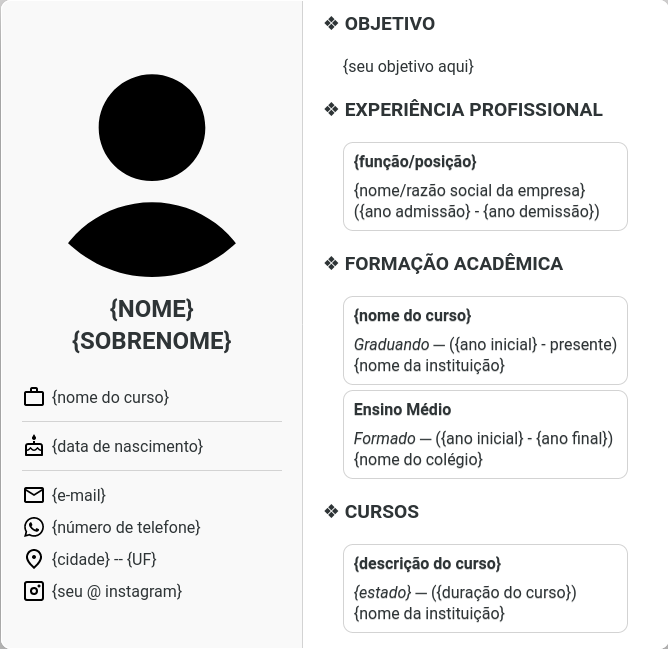

# curriculum-model

This is a curriculum model written in HTML as a university
home work.

It is under public domain via the CC0-1.0-Universal license.

## How to print it or export to PDF?

Printing the document is easy and you don't need to change anything to print it or export it to PDF.

You may use a tool of your choise to export the HTML to PDF, or use your web browser.

## Exporting with the web browser

> **NOTE**: the curriculum is ideal to be printed/exported with the default margins (2 cm) on A4 office papers. Other formats have not been tested.

In order to print with a web browser, please follow the steps below:

1. Open the file `index.html` with your favorite web browser;
2. Go to the main menu (looks like a hamburguer menu) and click on "Print";
3. On the combo box "Destination", select "Save as PDF" to export to PDF, or select your printer name to print it.

## Third-party resources

Below is a list of the third-party resources, including a link
to their license.

- Material Symbols from [Google Fonts](https://fonts.google.com/icons) -- License: [Apache-2.0](https://www.apache.org/licenses/LICENSE-2.0.html)

